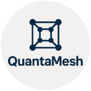

<div align="center">
  

  # Quanta Mesh

  ### *A Next-Generation Freelancing & Communication Hub*

  
  
  
  
  
  
</div>

---

## 🚀 Why Quanta-Mesh?

> *"Communication should be seamless, not regulated."*

In the rapidly evolving world of freelancing, direct and unrestricted communication is paramount. Traditional platforms often impose heavy regulations, fees, and communication barriers that stifle the natural flow of collaboration between clients and developers. 

**Quanta-Mesh** was born out of the need to break these barriers. 

We created this platform to provide a **streamlined, regulation-free environment** where clients can connect directly with us. Our goal is to ensure:
- ✅ **Seamless Collaboration** without third-party interference.
- ✅ **100% Transparency** in communication and deliverables.
- ✅ **Efficiency** by removing unnecessary bureaucratic hurdles.

This is more than just a website; it's a commitment to a better working relationship.

---

## ✨ Key Features

This project utilizes a modern, robust technology stack to deliver a premium user experience:

- **⚡ High Performance**: Built with **Vite** for lightning-fast development and optimized production builds.
- **🎨 Stunning UI/UX**: Crafted with **Tailwind CSS** and **shadcn/ui** for a clean, modern, and accessible interface.
- **📱 Fully Responsive**: A mobile-first approach ensures the app looks and works perfectly on all devices (Desktops, Tablets, Phones).
- **🔮 Immersive 3D Elements**: Integrated **Three.js** and **React Three Fiber** for engaging 3D visuals.
- **📊 Data Visualization**: Interactive and responsive charts powered by **Recharts**.
- **💾 Real-time Backend**: Secure authentication and database management via **Supabase**.
- **🔒 Type Safety**: Complete **TypeScript** integration for a robust, maintainable, and error-free codebase.
- **📲 PWA Support**: Progressive Web App capabilities for an installable, native-app-like experience.

---

## 🛠️ Tech Stack

| Category | Technology |
|----------|------------|
| **Frontend** | React 18, TypeScript |
| **Build Tool** | Vite |
| **Styling** | Tailwind CSS, Shadcn UI, Framer Motion |
| **State Management** | React Query (@tanstack/react-query) |
| **Forms** | React Hook Form, Zod |
| **Charts** | Recharts |
| **3D Graphics** | Three.js, React Three Fiber |
| **Backend / DB** | Supabase |
| **Routing** | React Router DOM |

---

## 🚀 Getting Started

Follow these instructions to set up the project locally.

### Prerequisites
Ensure you have the following installed:
- **Node.js** (v18+ recommended)
- **npm** or **bun** or **yarn**

### Installation

1. **Clone the repository**
   ```bash
   git clone https://github.com/ParasGupta-BCA/Quanta-Mesh.git
   cd Quanta-Mesh
   ```

2. **Install dependencies**
   ```bash
   npm install
   # or
   yarn install
   ```

3. **Start the development server**
   ```bash
   npm run dev
   ```

4. **Open in Browser**
   Visit `http://localhost:8080` (or the port shown in your terminal).

---

## 📂 Project Structure

```bash
/src
  ├── /components     # Reusable UI components (shadcn, custom)
  ├── /pages          # Application pages/routes
  ├── /hooks          # Custom React hooks
  ├── /integrations   # Third-party integrations (Supabase, etc.)
  ├── /lib            # Utility functions and configurations
  ├── /types          # TypeScript type definitions
  ├── App.tsx         # Main application component
  └── main.tsx        # Entry point
```

---

## 🤝 Contact & Hiring

**Ready to build something amazing together?**  
Since this platform is built for direct communication, feel free to reach out!

**Project URL:** [www.quantamesh.store](https://www.quantamesh.store)

---
*Built with ❤️ by Paras Gupta*
